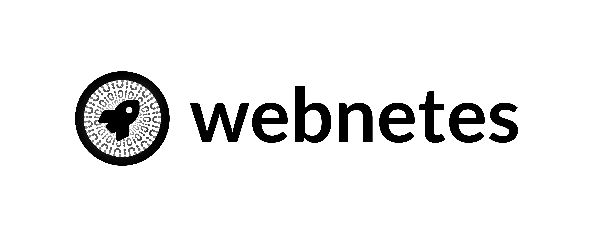

# The Webnetes Project

**The Webnetes Project** is an an effort to build a distributed compute system running in the browser and in node. It uses [WebAssembly](https://en.wikipedia.org/wiki/WebAssembly) for compute, [WebRTC](https://en.wikipedia.org/wiki/WebRTC) for networking and [WebTorrent](https://en.wikipedia.org/wiki/WebTorrent) for storage.

The Webnetes Project is free and open source, you can find the source code on [GitHub](https://github.com/alphahorizonio/webnetes). Issues and feature requests can be posted on the [GitHub issue tracker](https://github.com/alphahorizonio/webnetes/issues).

## License

The Webnetes Project © 2021 Felicitas Pojtinger and contributors

SPDX-License-Identifier: AGPL-3.0
