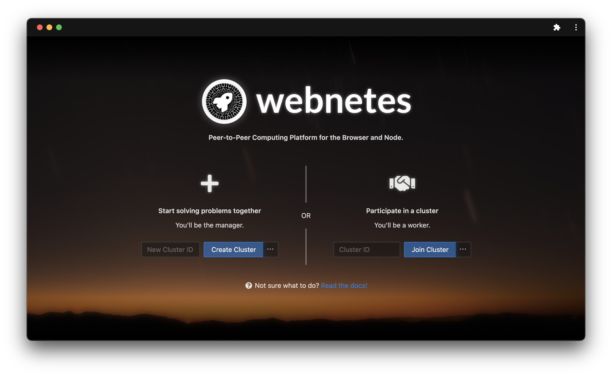
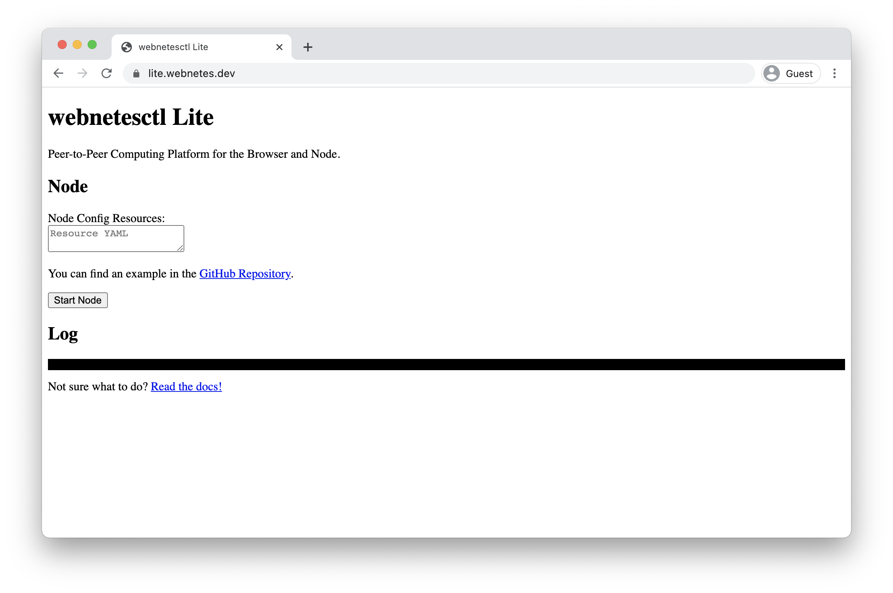

# App (webnetesctl)

## Introduction

To interact with the [node](./webnetes.md), an app is used. It provides an easy-to-use interface to develop, distribute and operate apps on Webnetes. It should be noted that while webnetesctl is the primary app, you can also choose to use an alternative for a more lightweight experience or even build your own app without too much effort.

## Implementations

### webnetesctl

Recommended for most users. Webnetesctl is built with React, Ant Design and the [node](./webnetes.md). For more information, check out the [source code](https://github.com/alphahorizonio/webnetesctl).

### webnetesctl Lite

For advanced users who prefer something more lightweight. Webnetesctl Lite is built with Vanilla JS; for more information, check out the [source code](https://github.com/alphahorizonio/webnetes/tree/main/app/webnetes_web).

