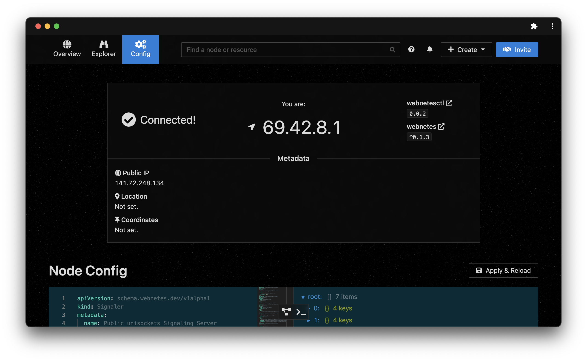
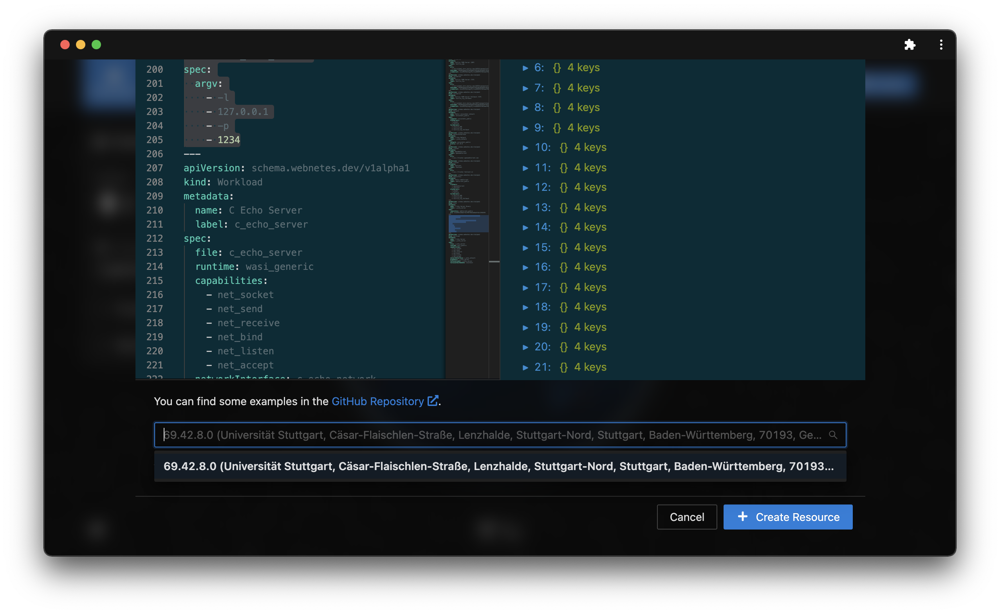

# Distribute

Now that you've got your app's build configuration up and running, you can start deploying your app to Webnetes. Doing so is a pretty simple process:

1. Define your app's resources using a `stack.yaml` file
2. Create a cluster using [webnetesctl](https://webnetes.dev/) or [webnetesctl Lite](https://lite.webnetes.dev/)
3. Invite nodes to your cluster
4. Deploy your app's resources to a desired target node
5. Open your app's terminal and interact with it!

Let's get started!

## Defining the Resources

The first step is to define your app's resources. Here you'll configure the app's capabilities, it's network configuration, runtime and so on. This is quite similar to how [Kubernetes](https://kubernetes.io/) handles it's resource definition; if you've used the latter before, you'll quickly get the hang of how to use Webnetes YAML.

You can find a pre-configured `stack.yaml` file for the examples in the corresponding source code; see [alphahorizonio/webnetes/examples](https://github.com/alphahorizonio/webnetes/tree/main/examples) for a list of all examples. To get a head start, you can use the `stack.yaml` of the example you've used. A typical `stack.yaml` (here of the C TCP Echo Server example) looks something like the following:

<details>
	<summary>YAML Source</summary>

```yaml
apiVersion: schema.webnetes.dev/v1alpha1
kind: Runtime
metadata:
  name: Generic WASI
  label: wasi_generic
spec: {}
---
apiVersion: schema.webnetes.dev/v1alpha1
kind: Capability
metadata:
  name: Creating a socket
  label: net_socket
spec: {}
---
apiVersion: schema.webnetes.dev/v1alpha1
kind: Capability
metadata:
  name: Sending over a socket
  label: net_send
spec: {}
---
apiVersion: schema.webnetes.dev/v1alpha1
kind: Capability
metadata:
  name: Receiving from a socket
  label: net_receive
spec: {}
---
apiVersion: schema.webnetes.dev/v1alpha1
kind: Capability
metadata:
  name: Binding an alias to a socket
  label: net_bind
spec: {}
---
apiVersion: schema.webnetes.dev/v1alpha1
kind: Capability
metadata:
  name: Listen on a socket
  label: net_listen
spec: {}
---
apiVersion: schema.webnetes.dev/v1alpha1
kind: Capability
metadata:
  name: Accept on a socket
  label: net_accept
spec: {}
---
apiVersion: schema.webnetes.dev/v1alpha1
kind: Processor
metadata:
  name: Felicitas's iPhone
  label: felicitass_iphone
spec:
  runtimes:
    - wasi_generic
  capabilities:
    - net_socket
    - net_send
    - net_receive
    - net_bind
    - net_listen
    - net_accept
---
apiVersion: schema.webnetes.dev/v1alpha1
kind: Signaler
metadata:
  name: Public unisockets Signaling Server
  label: unisockets_public
spec:
  urls:
    - wss://signaler.webnetes.dev
  retryAfter: 1000
---
apiVersion: schema.webnetes.dev/v1alpha1
kind: StunServer
metadata:
  name: Google STUN Server
  label: google
spec:
  urls:
    - stun:stun.l.google.com:19302
---
apiVersion: schema.webnetes.dev/v1alpha1
kind: StunServer
metadata:
  name: Twillio STUN Server
  label: twillio
spec:
  urls:
    - stun:global.stun.twilio.com:3478?transport=udp
---
apiVersion: schema.webnetes.dev/v1alpha1
kind: TurnServer
metadata:
  name: Twillio TURN Server (UDP)
  label: twillio_udp
spec:
  urls:
    - turn:global.turn.twilio.com:3478?transport=tcp
  username: f4b4035eaa76f4a55de5f4351567653ee4ff6fa97b50b6b334fcc1be9c27212d
  credential: w1uxM55V9yVoqyVFjt+mxDBV0F87AUCemaYVQGxsPLw=
---
apiVersion: schema.webnetes.dev/v1alpha1
kind: TurnServer
metadata:
  name: Twillio TURN Server (TCP)
  label: twillio_tcp
spec:
  urls:
    - turn:global.turn.twilio.com:3478?transport=tcp
  username: f4b4035eaa76f4a55de5f4351567653ee4ff6fa97b50b6b334fcc1be9c27212d
  credential: w1uxM55V9yVoqyVFjt+mxDBV0F87AUCemaYVQGxsPLw=
---
apiVersion: schema.webnetes.dev/v1alpha1
kind: TurnServer
metadata:
  name: Twillio TURN Server Fallback (TCP)
  label: twillio_tcp_fallback
spec:
  urls:
    - turn:global.turn.twilio.com:443?transport=tcp
  username: f4b4035eaa76f4a55de5f4351567653ee4ff6fa97b50b6b334fcc1be9c27212d
  credential: w1uxM55V9yVoqyVFjt+mxDBV0F87AUCemaYVQGxsPLw=
---
apiVersion: schema.webnetes.dev/v1alpha1
kind: Network
metadata:
  name: Public unisockets network
  label: unisockets_public
spec:
  signaler: unisockets_public
  stunServers:
    - google
    - twillio
  turnServers:
    - twillio_udp
    - twillio_tcp
    - twillio_tcp_fallback
---
apiVersion: schema.webnetes.dev/v1alpha1
kind: NetworkInterface
metadata:
  name: C Echo Network
  label: c_echo_network
spec:
  network: unisockets_public
  prefix: 127.19.0
---
apiVersion: schema.webnetes.dev/v1alpha1
kind: Tracker
metadata:
  name: OpenWebTorrent
  label: openwebtorrent
spec:
  urls:
    - wss://tracker.openwebtorrent.com
---
apiVersion: schema.webnetes.dev/v1alpha1
kind: Tracker
metadata:
  name: Fastcast
  label: fastcast
spec:
  urls:
    - wss://tracker.fastcast.nz
---
apiVersion: schema.webnetes.dev/v1alpha1
kind: Repository
metadata:
  name: Public WebTorrent
  label: webtorrent_public
spec:
  trackers:
    - openwebtorrent
    - fastcast
  stunServers:
    - google
    - twillio
  turnServers:
    - twillio_udp
    - twillio_tcp
    - twillio_tcp_fallback
---
apiVersion: schema.webnetes.dev/v1alpha1
kind: File
metadata:
  name: C Echo Server Binary
  label: c_echo_server
spec:
  repository: webtorrent_public
  uri: d1eb90cb38bbffd1705f49e3e68a57d2c104b594
---
apiVersion: schema.webnetes.dev/v1alpha1
kind: Arguments
metadata:
  name: C Echo Server Configuration
  label: c_echo_server
spec:
  argv:
    - -l
    - 127.0.0.1
    - -p
    - 1234
---
apiVersion: schema.webnetes.dev/v1alpha1
kind: Workload
metadata:
  name: C Echo Server
  label: c_echo_server
spec:
  file: c_echo_server
  runtime: wasi_generic
  capabilities:
    - net_socket
    - net_send
    - net_receive
    - net_bind
    - net_listen
    - net_accept
  networkInterface: c_echo_network
  arguments: c_echo_server
  terminalLabel: c_echo_server
  terminalHostNodeId: localhost
```

</details>

You can find a full reference of the available resources in the [resources YAML reference](../reference/resources-yaml.md).

## Seeding the WebAssembly Binary

Next up, you have to make the WebAssembly binary available to Webnetes. This is done using [WebTorrent](https://webtorrent.io/), a BitTorrent implementation using WebRTC. For your convenience, a `seed` Make target has been added to the examples, but you can also seed using something like [WebTorrent Desktop](https://webtorrent.io/desktop/), [instant.io](https://instant.io/), [webnetesctl](https://webnetes.dev/) or [webnetesctl Lite](https://lite.webnetes.dev/). For the following we'll use the `seed` Make target because it's the most convenient. Note that for Go there are two targets: `seed-go` and `seed-tinygo`. Consult the relevant [Develop section](./develop/go.md#make-configuration) for more information on what each target does.

Let's seed the WebAssembly binary; we'll use the [C TCP Echo Server](./develop/c.md#tcp-echo-server) as an example:

```shell
$ make seed
Seeding: echo_server.wasm
Info hash: d1eb90cb38bbffd1705f49e3e68a57d2c104b594
Speed: 0 B/s Downloaded: 47 KB/47 KB Uploaded: 0 B
Running time: 10 seconds  Time remaining: N/A  Peers: 0/
```

Note the `Info hash` value; using it, for as long as you keep the terminal open, you can now fetch the WebAssembly binary from anywhere in the world, using for example [instant.io](https://instant.io/). The info hash changes whenever your binary changes, which means that it also serves as a kind of checksum.

Before we can start deployment, don't forget to replace the `uri` of the `File` resource in the `stack.yaml` above with the `Info hash` from the `make seed` command. It should look something like this (depending on the example you're using):

```yaml
apiVersion: schema.webnetes.dev/v1alpha1
kind: File
metadata:
  name: C Echo Server Binary
  label: c_echo_server
spec:
  repository: webtorrent_public
  uri: d1eb90cb38bbffd1705f49e3e68a57d2c104b594
```

## Creating a Cluster

Let's create a cluster for our app. We'll use [webnetesctl](https://webnetes.dev/) from now on, but feel free to use [webnetesctl Lite](https://lite.webnetes.dev/) if you prefer something more lightweight.

First, open webnetesctl:

[](https://webnetes.dev/)

You'll be presented with a screen like the following:


We now have to create a cluster using a cluster ID. We'll choose `69.42.8` in this example. Enter this value in the `New Cluster ID` field and click on `Create Cluster`. You should be greeted by the following:


You've created a cluster! Next up is joining nodes. You can either scan the QR code with your phone or click on/share the link; nodes can join the cluster without any further configuration, after which they will see the following screen:


After a node has joined, a quick CPU & network benchmark runs and a short introduction is displayed. On the manager (where you got the link from), you can now go to the management interface by clicking on `Continue to Overview`. It looks something like this, depending on how many nodes you've added and whether the nodes have enabled location access by clicking on the location arrow in the center:


Before we'll continue deploying the resources, feel free to click around. By clicking a node you can get more information:


If you prefer a more traditional overview or are searching for something, the Explorer tab might be of use to you:


Feel free to try out the other tabs before you continue!

## Deploying the Resources

Let's deploy the resources. Doing so is simple; just click `+ Create` in the top menu and select `Resource`. Now, paste the contents of the `stack.yaml` file you've created above into the `Definition` editor; it's structure will be visualized to the right:


Next, let's adjust the server's network configuration by changing the `Arguments` resource to use an IP address in the within the cluster ID subnet we've created above (`69.42.8`):

```yaml
apiVersion: schema.webnetes.dev/v1alpha1
kind: Arguments
metadata:
  name: C Echo Server Configuration
  label: c_echo_server
spec:
  argv:
    - -l
    - 69.42.8.1
    - -p
    - 1234
```

This will set up the server to listen on `69.42.8.1:1234`.

Another thing you might want to change is the `terminalHostNodeId` of the `Workload` resource. This parameter specifies where to attach the terminal to; you probably want to attach it to your manager node for your convenience. To find your manager node's IP, minimize the dialog using the `_` button in the top right, and go to the `Config` tab:



Copy your IP, and open up the resource dialog again by clicking the tray in the bottom center. Now, replace the `Workload` resource's `terminalHostNodeId` key:

```yaml
apiVersion: schema.webnetes.dev/v1alpha1
kind: Workload
metadata:
  name: C Echo Server
  label: c_echo_server
spec:
  file: c_echo_server
  runtime: wasi_generic
  capabilities:
    - net_socket
    - net_send
    - net_receive
    - net_bind
    - net_listen
    - net_accept
  networkInterface: c_echo_network
  arguments: c_echo_server
  terminalLabel: c_echo_server
  terminalHostNodeId: 69.42.8.1
```

Let's select the node you want to deploy to:



And click `+ Create Resource`. This can take a while; feel free to minimize the dialog while the deployment is in process.

After the deployment has finished, and assuming you've set the `terminalHostNodeId` to the manager node's IP, a terminal should open up:


Awesome, you've just deployed your first app to webnetes! You could now repeat this process for the [C TCP Echo Client](./develop/c.md#tcp-echo-client) and test the full network, or continue to [Operate](./operate.md) for further operation resources.
