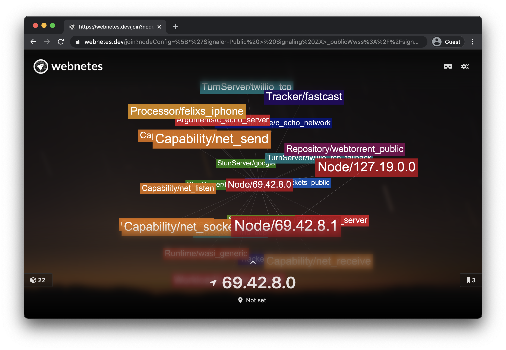
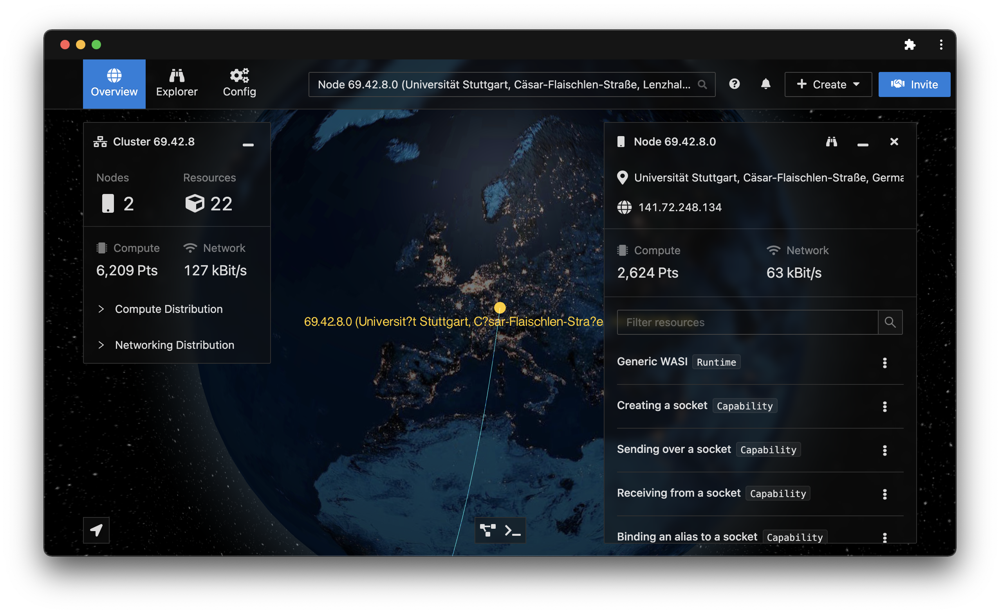
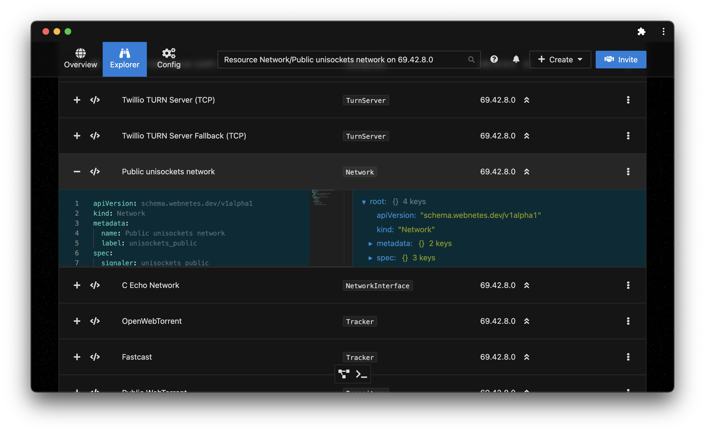

# Operate

After [distributing](./distribute.md), we have now successfully deployed some resources to the cluster.

On the target node, you can also check the resource graph to see the resources:

Feel free to play around with the target node's interface; you might find an easteregg or two 😉

On the management node, if we minimize the terminal and click on the target node, we can also see the newly created resources:

The resources can also be found in the explorer:

Using the explorer or the overview, resources can now also be deleted.

## You're Done!

🎉 That's it! You now know how to develop, distribute and operate your apps on Webnetes. There are many more features of Webnetes that we haven't touched on yet (the augmented reality resource graph, cluster statistics in the overview etc.), so feel free to play around with it!
